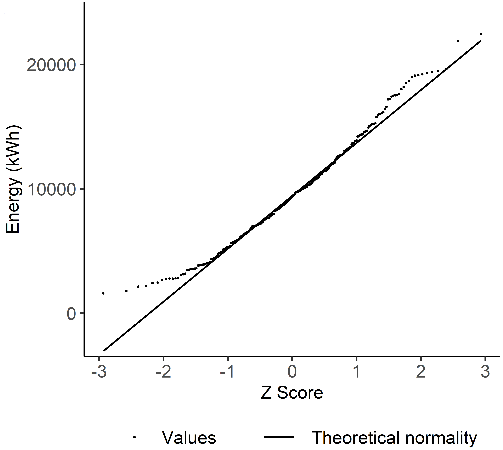
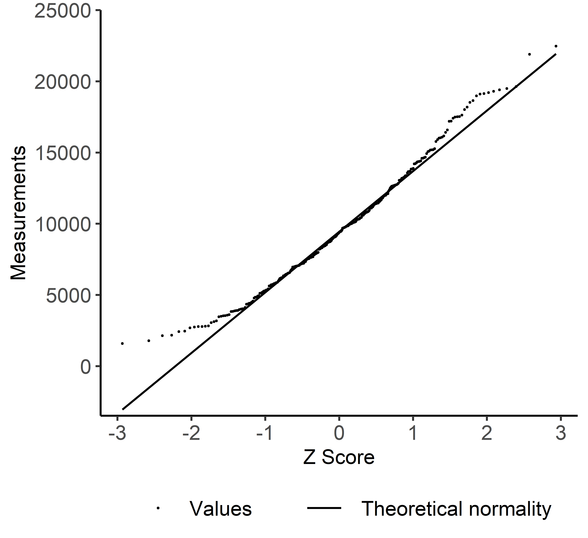
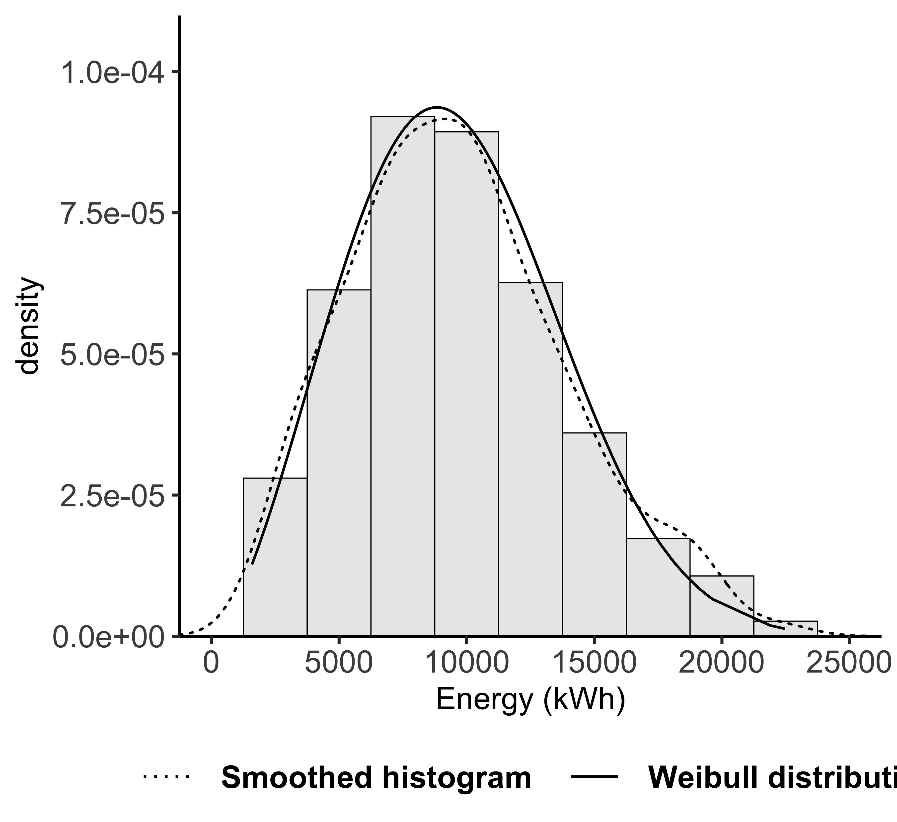
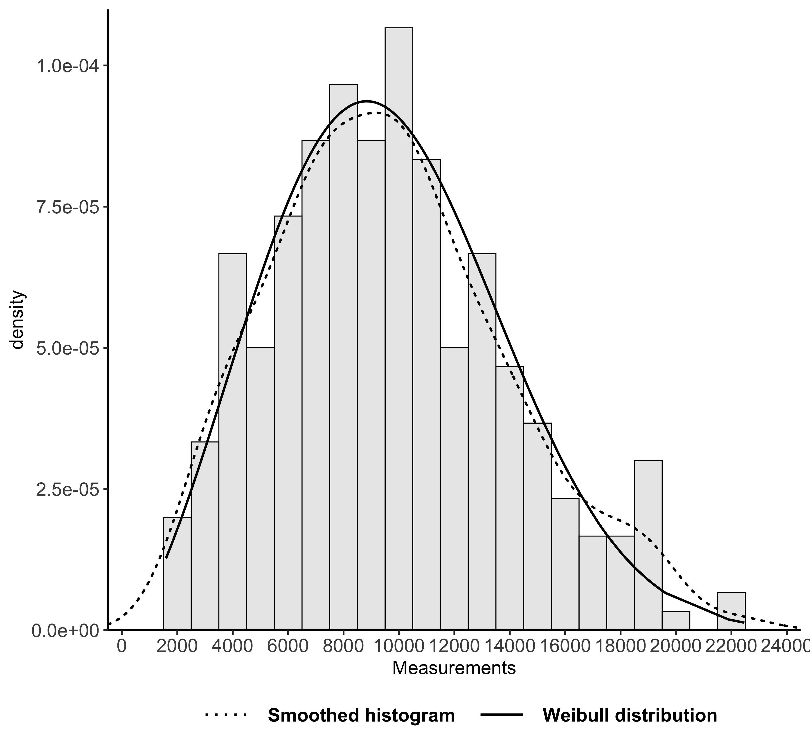

<!-- rmarkdown::find_pandoc(dir = '~/Paul Beagon PhD/R package/pandoc/') -->
<!-- rmarkdown::find_pandoc(dir = '~/Documents/PhD_local/R_package/pandoc') -->
<!-- https://bookdown.org/yihui/rmarkdown-cookbook/ -->
<!-- https://r-pkgs.org/index.html -->


## Background

Often a real-world data set comprises only positive values in a unimodal distribution. The
asymmetry and skewness of the data set, however, prevents its accurate representation by a normal
distribution. Energy use is one example. Its positive values are more accurately
parameterised by a log-normal distribution or Weibull
distribution; the latter contains approximations of the log-normal and normal
distributions. A two-parameter Weibull distribution is defined by its shape and scale. The distribution's versatility is implemented by its shape parameter -- values above 2.5 or 3.6 approximate to log-normal or normal distributions respectively [@NCSSLLC2019, p 122-15].

Regarding use cases, @Koch2011 proposed the log-normal distribution to represent the large variation
in energy use by homes in the same neighbourhood. The Weibull distribution has
been used to fit the energy-use data of 400 Swedish detached houses
[@Munkhammar2014], and 1643 social housing units in Northern Ireland
[@Irwin1986]. All the following code was written solely by the author during his PhD research into home energy retrofit at neighbourhood scale [@Beagon2020].

The  `distFit` R package offers threefold functionality to investigate goodness-of-fit with normal and Weibull distributions. First, calculates the shape and scale parameters of the theoretical Weibull distribution, second, compares the data set to plots of both distributions, and third, evaluates the data set's goodness-of-fit with both distributions.

## Statement of need
A gap exists in automated investigation if a real-world data set fits normality, or diverges to a Weibull distribution. Such an investigation should yield publishable plots, complemented by quantitative goodness-of-fit metrics. Package `distFit` provides functions to compare the
goodness-of-fit between the two distributions. Listing the four functions
intuitively: 1) `QQcompare()` plots the data set around the quantile-quantile (QQ) normality line, 2)
`findWeibullParams()` calculates the Weibull shape and scale parameters, 3)
`histWeibull()` plots the data set's histogram and smoothed line alongside its
Weibull distribution and finally, 4) `fitNormalWeibull()` tests *and* quantifies
the error of the data-set fits with the two distributions.

The four functions allow easy comparison of the data-set fit with both
distributions, both visually and quantitatively. Plot functions `QQcompare()`
and `histWeibull()` build on the popular `ggplot2` library [@Hadley2016]. Furthermore, both plot functions feature argument `interval.number` to easily change to axis intervals, and also resize `histWeibull()` histogram bins. These axis-interval changes are elegantly controlled by the `pretty()` function [@RCoreTeam2013], and transparent to the user. The parameters obtained from `findWeibullParams()` enable `fitNormalWeibull()` to test if the data-set values arose from the theoretical Weibull distribution. For details of the implementation in R, see the Anderson-Darling (AD) k-Sample test in the `kSamples` library [@Scholz2019]. Selection of the Anderson-Darling test is explained in literature: @Keller2011, @Engmass2011, @Nelson2018. <br>

Finally, the goodness-of-fit to each distribution are quantified by two
indices: coefficient of variation of the root mean square error CV(RMSE) and
normalised mean bias error (NMBE). Each index reveals a distinct characteristic
of the fitting errors. Specifically, CV(RMSE) and NMBE quantify the errors'
standard deviation and mean respectively [@Reddy2007]. See Mathematics section for formulas to calculate the Weibull parameters, CV(RMSE) and NMBE.
<br>

## Mathematics

The "graphical method" or linear regression is a popular method to estimate Weibull parameters, for instance in wind energy assessment [@Wais2017].
Conversion of a Weibull cumulative distribution to a linear equation requires
double logarithms on each side. Q is the probability that an energy value E is
less than E$_i$.

\begin{equation*} \label{eq:WeibullCDF}
  Q(E<E_i) = exp^{-(E_i/C)^k} 
\end{equation*}

Combining Weibull shape (k) and scale (C) parameters forms a linear equation.
Fitting this linear equation by least squares, estimates the Weibull
distribution parameters in the slope (k) and intercept (-kln(C)).

\begin{equation*} \label{eq:WeibullLinEq} 
  ln(-lnQ) = kln(E_i) - kln(C) 
\end{equation*}

The goodness-of-fit indices CV(RMSE) and NMBE are calculated across the total count (n) of measurements in the data set. After the data set is ordered, its measurements (m$_i$) are ranked by subscript i in the range 1--n. A predicted data set, also containing a total of n values, is generated from each distribution. Prediction errors equal m$_i$ subtracted by p$_i$, the corresponding value in the predicted data set. Finally, $\bar{m}$ represents the mean average of the measurements.

\begin{equation*} \label{eq:CVRMSE}
CV(RMSE) = \frac{1}{\bar{m}} \sqrt{\frac{\sum^n_{i=i}(m_i-p_i)^2}{n}}
\end{equation*}

\begin{equation*} \label{eq:NMBE}
 NMBE = \frac{1}{\bar{m}} \frac{\sum^n_{i=i}(m_i-p_i)}{n}
\end{equation*}
<br>

## Examples

Building on the statement of need, the following examples use `distFit` functions to complete a step-by-step data fitting. Each code example processes the 300-row date.frame `data` read from the package's test file `testData.csv`.   


#### 1) Plot quantile-quantile values compared to normality 

On receipt of a new data set, a first step is to check for a normal distribution, or normality. Sampling from a normally distributed population is commonly required in inferential statistics. Therefore `QQcompare()` plots a data set's QQ line of theoretical normality, alongside the its actual values. This plot clearly displays the values diverging from the QQ line. Such divergence is often located at distribution tails, indicated by high absolute Z scores on the horizontal axis. <br>
Each of the following `QQcompare()` code examples creates a different plot; the second example increases the `interval.number` from the default three to five in order to elegantly add vertical-axis labels. Both examples default to `base.size = 30`, ensuring the same text size across both plots.

```r
QQcompare(dataSet)
QQcompare(dataSet, interval.number = 5, label = "User-defined label") 
```

{width=45%}
{width=45%}
<br>

#### 2) Calculate Weibull parameters

If a data set of positive values is non-normal, an analyst may explore the Weibull distribution. Function `findWeibullParams()` calculates two Weibull parameters from the data set using a regression method (see Mathematics section). The function returns a list containing the shape and scale values as follows: 

```r
> params = findWeibullParams(dataSet)
> params$shape
[1] 2.51
> params$scale
[1] 10816.5
```
For reasons of consistency and coding efficiency, other package functions call `findWeibullParams()` when obtaining Weibull parameters. 
<br>
  
#### 3) Plot histogram compared to Weibull distribution

An analyst may now visualise the data set's fit to a Weibull distribution. Function `histWeibull` plots the data set's bar histogram and smoothed line. The smoothed line displays the data set's actual density, alongside the line showing the density of the theoretical Weibull distribution. <br>
Each of the following `histWeibull()` code examples create a different plot from the same data set. The second example increases the `interval.number` from the default three to eight in order to elegantly add horizontal axis labels. The first example defaults to `base.size = 30`, but the second example specifies `base.size = 20` to separate the more numerous axis labels caused by `interval.number = 8`.

```r 
histWeibull(dataSet) 
histWeibull(dataSet, interval.number = 8, label = "User-defined label", base.size = 20)
```

{width=45%}
{width=45%}
<br>

#### 4) Evaluate goodness-of-fit with normal and Weibull distributions

The last step is to evaluate _quantitatively_ the data-set fits to normal and Weibull distributions. Function `fitNormalWeibull()` calculates four goodness-of-fit metrics per each candidate distribution. An Anderson-Darling (AD) test produces a test statistic and p-value, followed by the aforementioned indices CV(RMSE) and NMBE. Thus the final list comprises eight metrics, four on the normal distribution, followed by four on the Weibull.

AD tests adopt a null hypothesis that the data set adheres to the specified  distribution. Since smaller AD statistics indicate less evidence of deviation from the specified distribution, they cause larger p-values. Put simply, p-values are the probably of incorrectly rejecting the null hypothesis of a the data set arising from the specified distribution. The following results confirm the superior fit to the Weibull distribution. Specifically, a smaller AD test statistic, a larger AD p-value, and smaller CV(RMSE) and absolute NMBE. (NMBE may be negative because it is the mean error, or subtraction, between ordered values of different data sets.)

```r
fitNormalWeibull(dataSet)
$normalADstat
[1] 0.671

$normalADp
[1] 0.5839

$normalCVRMSE
[1] 5.6

$normalNMBE
[1] -0.446

$weibullADstat
[1] 0.155

$weibullADp
[1] 0.9984

$weibullCVRMSE
[1] 2.84

$weibullNMBE
[1] 0.238
```

## Acknowledgments
The author thanks Dr Paul Cuffe who encourages publication of code, and Dr Fiona Boland who advised on statistical techniques.
This publication has emanated from research supported (in part) by Science
Foundation Ireland (SFI) under the SFI Strategic Partnership Programme Grant
Number SFI/15/SPP/E3125. The opinions, findings and conclusions or
recommendations expressed in this material are those of the author(s) and do not
necessarily reflect the views of the Science Foundation Ireland.


## References
